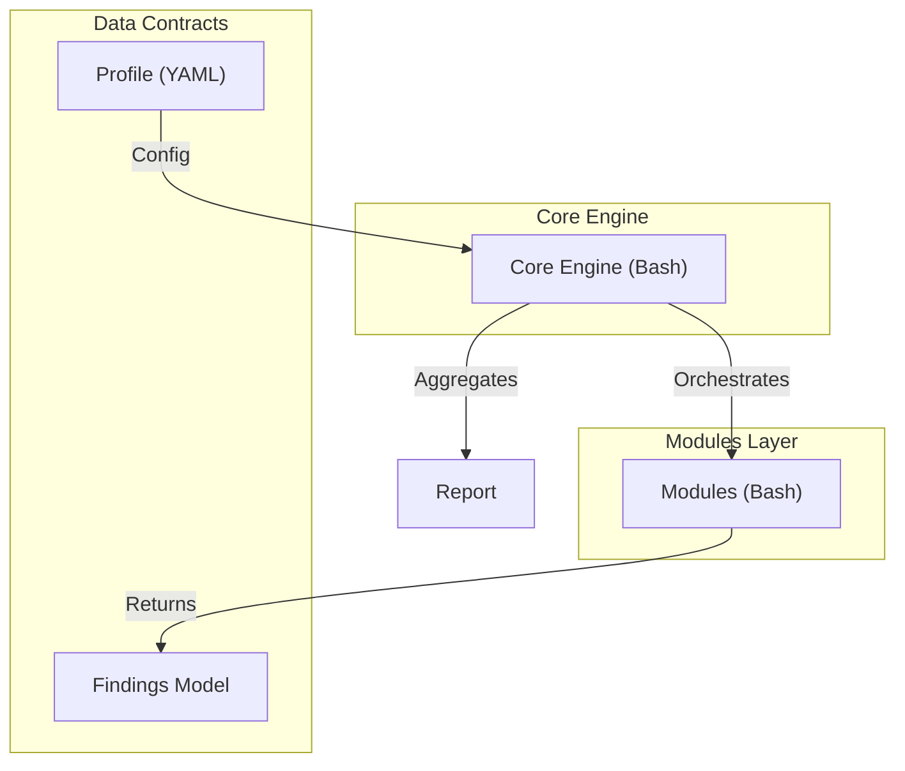
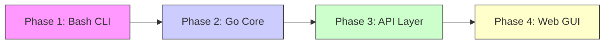

# IronBase v0 Architecture

## Vision
IronBase is a modular, future-proof Linux hardening engine. While v0 is implemented in Bash for portability and rapid prototyping, its architecture is designed from the ground up to support a future port to compiled languages (Go or Rust) without changing internal contracts or user experience.

## key Principles
1.  **Modularity**: Hardening logic is isolated in "modules". The core engine doesn't know about specific hardening rules.
2.  **Idempotency**: All operations (scan/apply) should be safe to run multiple times.
3.  **Observability**: Structured output (Findings Model) for easy parsing by future GUI/web layers.
4.  **Safety**: "Scan" is read-only. "Apply" is opt-in and conservative.
5.  **Fail-Fast Behavior**: Modules may implement fail-fast logic for critical prerequisites. If a module requires a prerequisite (e.g., UFW installed and active), it should stop scanning immediately when the prerequisite is not met, rather than continuing with checks that would produce misleading results.

## System Components




### 1. The Core Engine (`core/`)
The brain of IronBase. It is responsible for:
-   **Orchestration**: Loading modules and executing them in the correct order.
-   **Configuration**: Parsing the profile (`ubuntu-baseline.yaml`).
-   **Reporting**: Aggregating results using the **Findings Model**.

### 2. The Findings Model (`core/findings.sh`)
Standardized contract for security results.
-   **Severity**: INFO, LOW, MEDIUM, HIGH, CRITICAL.
-   **Status**: PASS, WARN, FAIL.
-   **Structure**: Title, Description, Evidence, Remediation.

### 3. Modules (`modules/`)
Self-contained units of hardening logic covering:
-   **System**: OS, Kernel, Updates, Time.
-   **Users**: Privileges, Sudoers, Roots.
-   **Network**: Ports, Binding, IPv6.
-   **Firewall**: UFW Status & Policies.
-   **SSH**: Config hardening.
-   **Services**: Docker, Auditd, Journald.
-   **Filesystem**: Critical path permissions.

Each module implements:
-   `module_meta`: Metadata.
-   `module_scan`: Read-only checks returning structured Findings. May implement fail-fast behavior for prerequisites.
-   `module_apply`: Active remediation (if implemented).

**Fail-Fast Example**: The `firewall` module stops scanning if UFW is not installed (FW-001) or inactive (FW-002). If UFW is inactive, the firewall scan stops after FW-002. This prevents advanced checks (FW-004 through FW-011) from executing when they would be meaningless or produce misleading results.

### 4. Profiles (`profiles/`)
YAML files that define the desired state.
Example:
```yaml
modules:
  ssh:
    enabled: true
  firewall:
    enabled: true
```

## Future Evolution Path




-   **Phase 1 (Now)**: Bash-based architecture, CLI only, Expanded Read-Only Scan.
-   **Phase 2**: Port `core/` to Go. Modules can remain in Bash (executed by Go) or be rewritten in Go.
-   **Phase 3**: Add a REST API or gRPC layer on top of `core/` for remote management.
-   **Phase 4**: Build a React/Tauri GUI that consumes the API.
